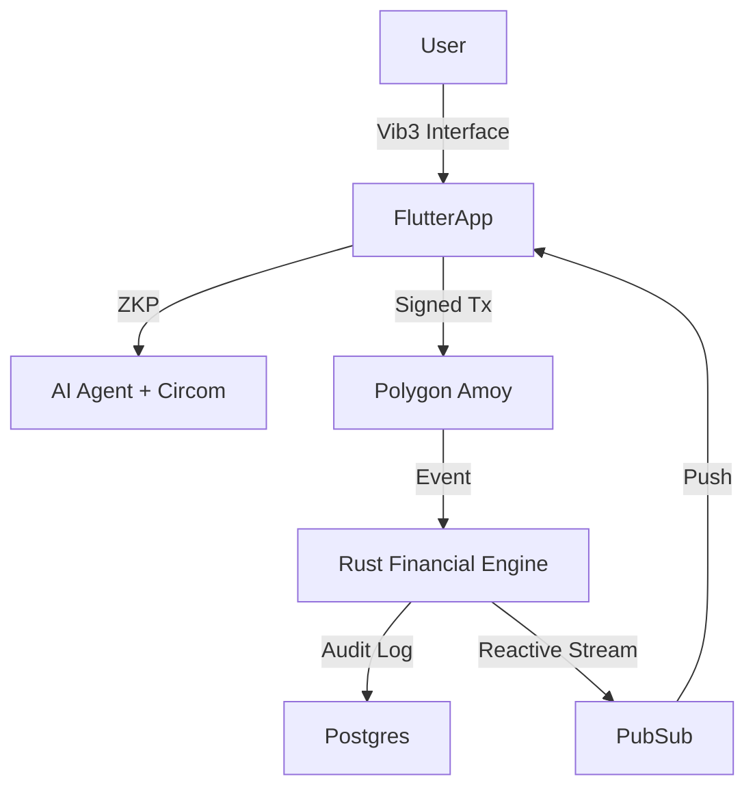

# IdeaCapital: The Decentralized Invention Capital Protocol
**Whitepaper v2.0 (2026 Edition)**

> *"Bridging the Valley of Death between Innovation and Capital via Zero-Knowledge Provenance and Liquid Democracy."*

---

## 1. Executive Summary

In the 2026 innovation economy, intellectual property (IP) remains the most illiquid asset class. The "Valley of Death"—the gap between a prototype and a patent—kills 95% of viable inventions. Traditional venture capital is too slow, and traditional patent law is too expensive ($25k+ average).

**IdeaCapital** is the world's first **DeIPF (Decentralized Intellectual Property Finance)** ecosystem. By tokenizing the *provenance* of an idea, we allow inventors to raise capital for patent prosecution instantly, while providing investors with a programmed, compliant claim on future licensing royalties.

---

## 2. The Problem: The "Closed-Source" Trap

1.  **The Inventor's Dilemma:** You cannot prove you invented something without revealing it. Once revealed, it is no longer patentable (prior art).
2.  **Liquidity Lock:** IP is illiquid until it is granted (3-5 years). Capital is frozen.
3.  **Legal Gatekeeping:** High legal fees exclude 90% of global inventors.

---

## 3. The Solution: The Knowledge Provenance Protocol (KPP)

IdeaCapital solves this trilemma with a dual-layer architecture:

### A. DeSci Novelty Verification (Zero-Knowledge)
We use **ZK-SNARKs** (Groth16/Circom) to prove an inventor possesses a specific document at a specific time *without revealing its contents*.
-   **Result:** Proof of Prior Art without public disclosure.
-   **Impact:** Investors fund the "verified existence" of an invention safely.

### B. Programmable Equity (The Vault)
We implement the **Arizona ABS (Alternative Business Structure)** model on-chain.
-   **Smart Contracts:** Automatically split revenue between Inventors, Investors (DAO), and Compliance Lawyers.
-   **Fail-Closed Security:** If a compliance check fails, no funds move. "Code is Law, but Law is also Law."

### C. Vib3 Visual Identity
Every IP asset generates a unique **4D Procedural Watermark**.
-   **Tech:** Deterministic shader generation based on blockchain hash.
-   **Value:** Instant visual recognition of IP lineage and rarity.

---

## 4. Tokenomics

The ecosystem is powered by a dual-token model:

| Token | Symbol | Type | Utility |
|-------|--------|------|---------|
| **Reputation** | `REP` | Soulbound (ERC-20) | Non-transferable voting power. Earned by successful inventions/vetting. |
| **Royalty** | `ROY` | ERC-20 | Transferable revenue claim. Represents fractional ownership of a specific patent. |

### Governance (Liquid Democracy)
-   **Delegation:** `REP` holders can delegate voting power to domain experts (e.g., "Delegate my Biotech votes to Alice").
-   **Execution:** Successful proposals trigger on-chain parameter updates (e.g., Platform Fee %).

---

## 5. Technical Architecture

Our stack is built for the "2026 Standard" of durability and modularity.

---

## 6. Strategic Roadmap

### Phase 1: Foundation (Completed)
- [x] **Merkle-Proof Dividends:** Gas-efficient revenue distribution.
- [x] **Vib3 Identity:** Procedural visual DNA.
- [x] **ABS Compliance:** Legal fee splitting logic.

### Phase 2: Deep Tech (Q2 2026)
- [ ] **Marketplace:** Secondary trading of Royalty Tokens.
- [ ] **Story Protocol V2:** Cross-chain IP licensing and royalty stacking.
- [ ] **Privacy Layer:** Full client-side ZK proof generation (WASM).

### Phase 3: The Network State (Q4 2026)
- [ ] **Jurisdiction Agnosticism:** Adapting ABS logic for EU/Asia.
- [ ] **AI Examiner:** Autonomous prior art search and patentability scoring.

---

## 7. Investment Thesis

IdeaCapital is not just a "crypto project." It is **Financial Infrastructure for Science**. By unlocking the liquidity of early-stage IP, we aim to increase the global velocity of innovation by 10x.

**Join us in building the Registry of the Future.**
